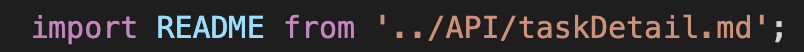
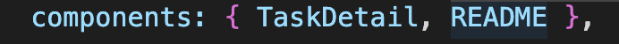
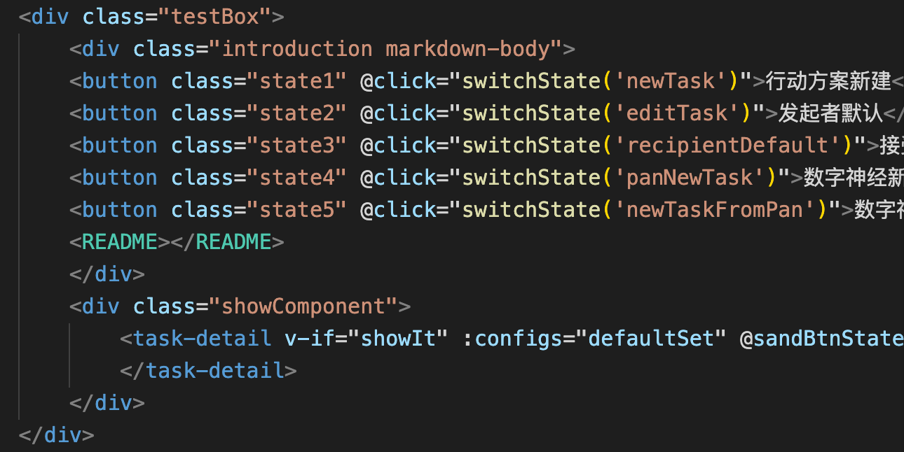

# 在VUE项目中使用.md文件

1. 安装依赖
```
yarn add vue-markdown-loader
yarn add github-markdown-css
yarn add highlightjs-line-numbers.js
```
vue-markdown-loader : 在内部使用markdown-it将markdown文件转化为vue组件  
github-markdown-css: markdown样式  
highlightjs-line-numbers.js: 高亮markdown样式并导入行号  

2. 添加配置信息
在vue.config.js文件中添加配置信息让webpack可以解析编译md文件
```
chainWebpack: config => {
    config.module
      .rule("md")
      .test(/\.md$/)
      .use("vue-loader")
      .loader("vue-loader")
      .end()
      .use("vue-markdown-loader")
      .loader("vue-markdown-loader/lib/markdown-compiler")
      .options({
        raw: true
      });
  }
```
3. 使用方法
   1） 导入.md文件
    
   2） 在components中添加
    
   3） 在代码中以组件的方式使用
    
    > 要在组件的容器添加markdown-body的class来使用md样式


